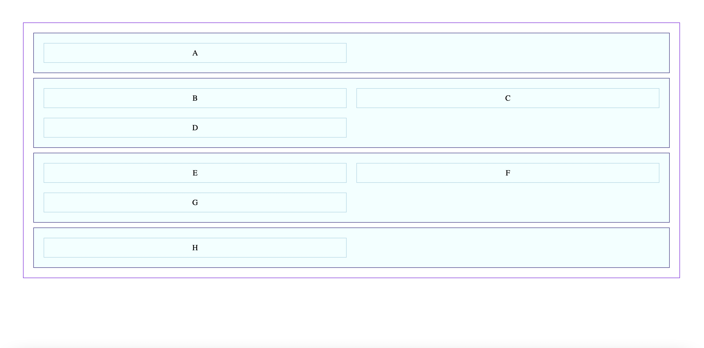
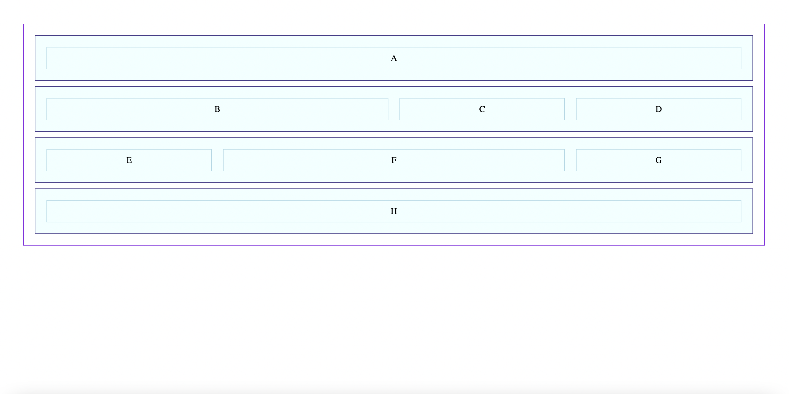

# CSS GRID WARMUP

## Fork and Clone this Repo

Take a look at the code in this repo, (both HTML & CSS ), which makes use of a pattern of "rows" that encapsulate a series of div elements.

Study the images carefully.

Update the CSS so that it matches the image below.

**Hint:** You must add styles for the full and wide classes.

And that's not all... You still might have to make another CSS change.

Don't overcomplicate it!

## STARTING IMAGE

## ENDING IMAGE

