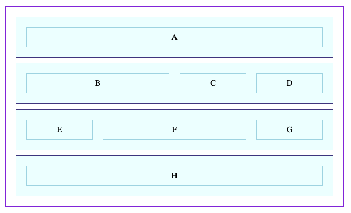

# CSS GRID WARMUP

Take a look at the code in this repo, which makes use of a pattern of "rows" that encapsulate a series of div elements.

Update the CSS so that it matches the image below.

**Hint:** You must add styles for the full and wide classes. And that's not all!

